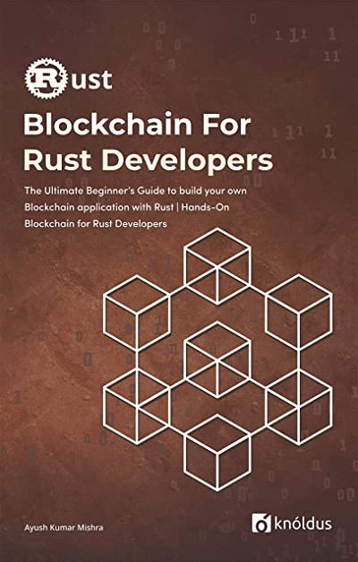

# Blockchain for Rust Developers

Suggested implementation for learning the basics of blockchain from the book Blockchain for Rust Developers.



## Example Output

```
Block Mined
true
Blockchain {
    blocks: [
        Block {
            timestamp: 1637959605,
            hash: "00b5580b70a641c70a486606d1231ea3079006bd0ea41c1ddbaa21c9a43ef643",
            pre_hash: "0",
            transactions: [
                Transaction {
                    sender: Some(
                        PublicKey(CompressedEdwardsY: [79, 252, 33, 99, 46, 115, 106, 134, 228, 55, 27, 145, 252, 250, 77, 46, 7, 138, 39, 109, 229, 57, 167, 236, 252, 76, 205, 10, 89, 10, 113, 185]), EdwardsPoint{
                        	X: FieldElement51([888096863305231, 1688093174482936, 1763668118255273, 1886216423700417, 24327606141074]),
                        	Y: FieldElement51([1538796485215134, 461719138183065, 1896043676445097, 292030118235675, 704900565883453]),
                        	Z: FieldElement51([609755650082226, 51006955191122, 1507664062674697, 912185209705293, 1120425966672238]),
                        	T: FieldElement51([1243675587077800, 178596856010047, 148618989657928, 1554043402835468, 1022289411617844])
                        }),
                    ),
                    receiver: Some(
                        PublicKey(CompressedEdwardsY: [19, 226, 251, 186, 254, 238, 10, 27, 94, 27, 110, 85, 57, 180, 217, 26, 210, 161, 188, 30, 231, 61, 235, 167, 235, 213, 134, 153, 1, 114, 58, 107]), EdwardsPoint{
                        	X: FieldElement51([1114016003653678, 1434540122990529, 1021884711111596, 428791921205011, 1738543492024133]),
                        	Y: FieldElement51([1505317236299747, 1330154759548617, 222965285125974, 15303493687410, 176218598556181]),
                        	Z: FieldElement51([739272323028876, 1277504049106757, 1583047392756625, 1002339781929155, 1043198551561067]),
                        	T: FieldElement51([1752580754912216, 1335801261727410, 388208208759356, 2014496022298864, 493962614028172])
                        }),
                    ),
                    amount: 2000.0,
                    signature: Some(
                        ed25519::Signature(E24A201768CCB1EB2EFE031CC8F368054C2FC96BE06682A2611EC64230A71B2EDBCD3B810A06911FD4AC06D036EEE5653526B76F80B2A38A2B710897199C7F03),
                    ),
                },
                Transaction {
                    sender: None,
                    receiver: Some(
                        PublicKey(CompressedEdwardsY: [251, 99, 154, 35, 53, 227, 158, 43, 26, 202, 221, 72, 82, 190, 225, 61, 235, 179, 81, 136, 170, 227, 134, 214, 209, 89, 154, 174, 195, 10, 89, 219]), EdwardsPoint{
                        	X: FieldElement51([273606777664305, 344936939552299, 1907678548902468, 1972389969969855, 1142044306230620]),
                        	Y: FieldElement51([1092912176945951, 844619296281261, 1031862798517216, 414998548004213, 2015392875635547]),
                        	Z: FieldElement51([263190699195046, 1258801779722980, 347788682286982, 1917514181914911, 1686918786825525]),
                        	T: FieldElement51([631140482222451, 833402229090684, 154830008845054, 811210344816095, 988976110748869])
                        }),
                    ),
                    amount: 100.0,
                    signature: None,
                },
            ],
            nonce: 476,
        },
    ],
    unmined_transactions: [],
    mining_reward: 100.0,
}
```

## License

This code is part of the book Blockchain for Rust Developers (Ayush Kumar Mishra) and should not be used or modified without express authorization from the author.
